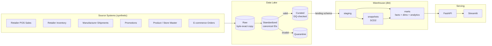

# CPG Pulse

**Omnichannel Sales, Inventory, and Promotion Intelligence Platform for a fictional CPG manufacturer.**

An end-to-end data engineering platform - synthetic data generation, batch
ingestion, PySpark standardization, a dimensional warehouse built with dbt,
a FastAPI service, and a Streamlit dashboard - built to demonstrate
production-style data engineering practice, not a toy ETL script.

> **This project's data, company, and retailers are entirely fictional.**
> No real company, retailer, or consumer data is used anywhere.

---

## The Business Problem

A CPG manufacturer sells hundreds of products across multiple retail and
e-commerce channels (a big-box mass merchandiser, a grocery chain, and an
online marketplace, plus its own DTC storefront). Each retailer sends sales,
inventory, and promotion data in its own format, on its own schedule, using
its own product and store identifiers. Internally, the company's ERP system
tracks manufacturer shipments and owns the authoritative product master.

Because there's no shared identifier space and no shared data model across
these sources, Sales, Supply Chain, and Category Management teams can't
answer basic questions - "are we in stock at this store?", "did last month's
promotion actually work?" - without manual, spreadsheet-based reconciliation.

CPG Pulse is a data platform that ingests these heterogeneous sources,
conforms them to a canonical product/store/retailer identifier space,
validates data quality, models the result as a dimensional warehouse, and
serves curated, analytics-ready metrics to a dashboard and an API - on a
schedule, with lineage, history, and monitoring.

## Business Questions This Platform Answers

1. Which products, brands, categories, and retailers generate the most sales?
2. Which stores/regions are at risk of stocking out?
3. Which stores have excess inventory or low sell-through?
4. Are manufacturer shipments aligned with consumer POS sales?
5. Which promotions generated meaningful incremental sales, and what was the ROI?
6. How does performance differ between physical retail and e-commerce?
7. Which incoming data sources have quality or freshness issues?

See `docs/architecture.md` §2 for the full business use-case list.

---

## Architecture



Full architecture, component design, and every design decision explained:
**[`docs/architecture.md`](docs/architecture.md)**.

## Tech Stack

Python · PostgreSQL · PySpark · Apache Airflow · dbt · Snowflake-compatible
DDL · FastAPI · Streamlit · Docker Compose · GitHub Actions · Terraform
(documented, not applied)

**Local-first, cloud-compatible**: everything runs on a laptop via Docker
Compose (Postgres standing in for Snowflake, MinIO standing in for S3) - see
`docs/architecture.md` §7 for exactly what changes to point the same code at
real AWS/Snowflake.

## Repository Layout

```
cpg-pulse/
├── scripts/data_gen/     synthetic data generator (9 sources, seasonality, injected DQ issues)
├── ingestion/            per-source ingestion: file discovery, watermarks, schema-drift detection
├── spark/                PySpark standardization jobs + config-driven DQ engine
├── dbt/                  staging -> intermediate -> marts, SCD2 snapshots, tests
├── warehouse/            hand-reviewable DDL (Postgres validated live; Snowflake translated)
├── api/                  FastAPI service (12 endpoints, service-layer architecture)
├── dashboard/             Streamlit dashboard (6 pages)
├── airflow/               Docker image for orchestration
├── tests/                 unit, integration, data-quality suites (204 tests)
├── infrastructure/        Postgres init scripts, Terraform (documented)
├── .github/workflows/     CI: lint, secret-scan, test (Postgres service container), docker-build
└── docs/                  architecture, data dictionary, metrics, runbook, this project's full paper trail
```

---

## Setup

```bash
git clone <this-repo>
cd cpg-pulse
make setup              # .env from .env.example, pip install -r requirements.txt
make up                 # Docker Compose: Postgres, MinIO, Airflow
make seed                # apply metadata schema, create MinIO buckets (idempotent)
make generate-data-sample # small synthetic dataset (~3 seconds)
```

Then either use the committed `data/sample/` directly, or run the full
pipeline:

```bash
python -m ingestion.retailer_sales.ingest
python -m ingestion.inventory.ingest
# ... (see docs/runbook.md §3 for all 6 ingestion modules)
python spark/jobs/standardize_pos_sales.py      # requires a working local Spark -- see docs/runbook.md §4
python scripts/load_to_warehouse.py             # or --generated-dir data/sample for the fast path
cd dbt && dbt seed && dbt run --select staging && dbt snapshot && dbt run --exclude staging && dbt test
make api                                        # http://localhost:8000/docs
make dashboard                                  # http://localhost:8501
```

**Full step-by-step operational guide, including every real gotcha
encountered while building this**: **[`docs/runbook.md`](docs/runbook.md)**.

## Testing

```bash
pytest tests/ api/tests/ -v   # 115 Python tests (generator, ingestion, DQ engine, API)
cd dbt && dbt test             # 89 dbt tests
```

**204 tests total: 199 passing, 5 honestly skipped** with a documented reason
(the 5 require a live Spark job execution; they run for real inside the
Docker Compose `airflow-scheduler` container - confirmed, see Known
Limitations below - but skip on a bare Windows host, which has no working
JVM/PySpark path) rather than mocked or silently omitted. See
`docs/checklist.md` Phase 8 for the full breakdown, including real bugs that
were found and fixed *by* writing these tests and by live Docker validation
(not just found ahead of time and tested around):

1. A backfill for an old date range was silently regressing the ingestion
   watermark backward - fixed in `ingestion/common/base_ingest.py`.
2. `dbt snapshot` run before `dbt run` fails on a fresh database (the SCD2
   snapshots read from staging models, which must exist first) - fixed in
   the CI workflow, `Makefile`, and this project's own docs.
3. `scripts/load_to_warehouse.py` OOM-killed its container loading 3.76M
   curated rows via a single `pd.read_parquet()` + `to_sql()` call - fixed by
   streaming the curated Parquet directory in batches via `pyarrow.dataset`.
4. That streaming fix initially dropped the Hive-partition date column
   (`transaction_date`/`snapshot_date`) that Spark's `partitionBy()` write
   encodes only in directory names - fixed by passing `partitioning="hive"`
   to the `pyarrow.dataset` reader. See `docs/runbook.md` §5 for both.

---

## Data Model

9 synthetic source datasets (retail POS sales, inventory, manufacturer
shipments, promotions, product master, store master, retailer↔product
mapping, retailers, distribution centers, e-commerce orders, calendar) flow
through a layered lake (raw → standardized → curated) into a dbt-built
dimensional warehouse: 8 dimensions (2 as real SCD Type 2 - verified live by
mutating a product's cost and confirming the history split correctly), 6
facts, and 8 analytics marts (stockout risk, excess inventory, shipment
reconciliation, promotion effectiveness, omnichannel performance, retailer
and product scorecards, data-quality summary).

- **Full column-level reference**: [`docs/data_dictionary.md`](docs/data_dictionary.md)
- **How each source flows through every layer**: [`docs/source_to_target_mapping.md`](docs/source_to_target_mapping.md)
- **Every business metric's formula, required tables, and assumptions**: [`docs/metrics.md`](docs/metrics.md)

## Business Metrics

Units sold, gross/net sales, ASP, discount rate, sales velocity,
sell-through rate, inventory turnover, days/weeks of supply, out-of-stock
rate, excess inventory rate, shipment-to-POS variance, order-to-delivery
lead time, promotion lift/incremental units/ROI, return rate, e-commerce
sales share, retailer/category contribution, data freshness, DQ pass rate -
all defined with formula, required tables, SQL, and stated assumptions in
**[`docs/metrics.md`](docs/metrics.md)**.

**Promotion lift/ROI are explicitly analytical estimates, not causal
inference** - no control group exists, and the estimate is sample-size
sensitive (empirically verified: see `docs/metrics.md`'s Promotion Lift
section for the actual before/after numbers from that investigation).

---

## Screenshots

The dashboard's 6 pages (Executive Overview, Sales Performance, Inventory
Intelligence, Promotion Analytics, Shipment Reconciliation, Data Quality &
Pipeline Ops) were verified live - actually opened in a headless Chromium
browser via Playwright, clicked through, and screenshotted, confirming real
data renders correctly (not just that the code runs without throwing). That
screenshot session's images live in this project's build history but weren't
committed to the repo (see `docs/checklist.md` Phase 7); regenerate them the
same way (`docs/remaining_work.md` §3 has the exact approach) and drop them
here.

## Known Limitations

Stated plainly, not glossed over - see `docs/remaining_work.md` §5 for the
full detail behind each:

- **PySpark cannot execute a job on this project's Windows/Python 3.12
  development host** (a documented worker-process crash, not a code defect).
  This is now fully resolved for the intended deployment target: the same
  jobs (`standardize_pos_sales.py`, `standardize_inventory.py`,
  `run_quality_checks.py`) were run for real inside the Docker Compose
  `airflow-scheduler` container (Debian + `default-jdk-headless`) against the
  full 3.85M-row/582K-row generated dataset, with real output validated at
  every layer (standardized → curated → warehouse → dbt marts → API →
  dashboard). Windows remains unsupported for direct (non-Docker) Spark
  execution; Docker is the supported path, and it works.
- **`docker compose up` has been run end-to-end**, including a full pipeline
  run through it (ingestion → PySpark standardization → DQ → warehouse load
  → dbt → API → dashboard, all with real data, dashboard screenshot showing
  $73.9M net sales). Three real bugs were found and fixed doing this: two
  `airflow/Dockerfile`/`requirements-airflow.txt` issues (missing JDK, and
  pinned-package conflicts with Airflow's constraints file) and the
  `load_to_warehouse.py` OOM + Hive-partitioning bugs above - see
  `docs/runbook.md` §1 and §5.
- **Airflow DAG files don't exist yet** - orchestration is designed for
  (docstrings reference `dag_id`s, `docker-compose.yml` provisions the
  Airflow containers) but the actual DAG Python files were never written.
- Only 2 of 5 transactional sources (POS sales, inventory) got full PySpark
  standardization jobs; the rest use a documented, simpler local-dev fallback.
- No real Snowflake or AWS account was ever available - the Snowflake DDL is
  a careful manual translation of the live-verified Postgres schema, not
  independently executed.
- API has no authentication layer (explicitly out of scope for this
  portfolio build).
- Promotion lift/ROI are estimates, not causal inference (see above).

## Future Enhancements

- Write the Airflow DAGs and actually run the full stack under `docker compose up`.
- Build the missing Spark standardization jobs (shipments, promotions, ecommerce).
- Incorporate `on_order_units`/supplier lead time into the stockout-risk formula.
- Point-in-time-correct SCD2 joins for historical category/brand reporting.
- Real Snowflake deployment via Terraform (`infrastructure/terraform/`).
- Sales-growth and trend metrics as first-class API endpoints, not just ad hoc queries.

## Interview Talking Points

**[`docs/interview_prep.md`](docs/interview_prep.md)** - resume bullets and
interview Q&A grounded in what was actually built and actually validated,
including the real bugs found along the way (finding and fixing bugs via
live testing is a stronger interview story than "everything worked first
try").

---

## Documentation Index

| Doc | Covers |
|---|---|
| [`docs/architecture.md`](docs/architecture.md) | Full architecture, component design, every design decision and its rationale |
| [`docs/data_dictionary.md`](docs/data_dictionary.md) | Column-level reference for all sources and warehouse tables |
| [`docs/source_to_target_mapping.md`](docs/source_to_target_mapping.md) | How each source flows raw → standardized → curated → staging → marts |
| [`docs/metrics.md`](docs/metrics.md) | Every business metric: formula, tables, SQL, assumptions |
| [`docs/runbook.md`](docs/runbook.md) | How to run, troubleshoot, and operate every stage |
| [`docs/checklist.md`](docs/checklist.md) | Phase-by-phase build log - what's done, what's proven, what's not |
| [`docs/remaining_work.md`](docs/remaining_work.md) | Handoff document from the session that built Phases 1-7 |
| [`docs/interview_prep.md`](docs/interview_prep.md) | Resume bullets + interview Q&A |
