# CPG Pulse — Architecture & Planning (Phase 1)

## 1. Final Problem Statement

A mid-size CPG manufacturer ("CPG Pulse Foods & Home") sells ~100+ SKUs across food,
beverage, and personal-care categories through 3+ retail partners (a big-box retailer,
a club/grocery retailer, and an e-commerce marketplace) plus its own direct-to-consumer
e-commerce channel. Each retailer transmits point-of-sale (POS) sales, inventory, and
promotion data in its own format, on its own schedule, using its own product and store
identifiers. Internally, the company's ERP system tracks manufacturer shipments and
maintains the authoritative product master.

Because there is no shared identifier space and no shared data model across these
sources, Sales, Supply Chain, and Category Management teams cannot answer basic
questions ("are we in stock at Store #4021?", "did last month's promotion actually
lift sales?") without manual, spreadsheet-based reconciliation that is slow, inconsistent,
and error-prone. There is no single trusted place to look.

CPG Pulse is a data platform that ingests these heterogeneous sources, standardizes and
conforms them to a canonical product/store/retailer identifier space, validates data
quality, models the result as a dimensional warehouse, and serves curated,
analytics-ready metrics to dashboards and an API — on a schedule, with lineage,
history, and monitoring, the way a real CPG data engineering team would build it.

## 2. Business Use Cases

| # | Persona | Use case |
|---|---------|----------|
| 1 | Category Manager | Rank products/brands/categories/retailers by sales |
| 2 | Category Manager | Compare actual SKU velocity to expected velocity |
| 3 | Supply Chain Analyst | Identify stores/regions at stockout risk |
| 4 | Supply Chain Analyst | Identify excess inventory / low sell-through stores |
| 5 | Supply Chain Analyst | Reconcile manufacturer shipments vs. consumer POS sales |
| 6 | Trade Marketing | Measure promotion lift and ROI |
| 7 | Trade Marketing | Distinguish incremental demand from pulled-forward/shifted sales |
| 8 | Sales Analytics | Detect unusual sales spikes/drops for investigation |
| 9 | Channel Manager | Compare physical retail vs. e-commerce performance |
| 10 | Data/Analytics Engineer | Monitor source freshness and data-quality health |

## 3. Assumptions

- This is a **fictional** company; all data is synthetic. No real retailer, brand, or
  consumer data is used anywhere.
- "Production-style" means the code, patterns, and architecture are what a real team
  would deploy — not that it is deployed with a real cloud budget, real SLAs, or real
  traffic.
- Retailers are assumed to send **daily batch files** (not real-time streams). This
  matches how most mid-size CPG EDI/retailer-portal integrations actually work
  (e.g., nightly POS extracts), so batch orchestration (Airflow) is the right paradigm,
  not a streaming platform.
- The canonical product/store identifier space is owned by CPG Pulse (the manufacturer),
  not by any retailer. Retailer IDs are always mapped **into** the canonical space, never
  the reverse.
- Promotion effectiveness is estimated analytically (baseline-vs-actual), not via a
  causal-inference or ML model. This is stated explicitly in `docs/metrics.md` and in
  the dashboard.
- No real AWS/Snowflake accounts are provisioned for this environment. See §8 for how
  local and cloud deployment stay code-compatible.
- Data volume is "demo-realistic," not production-scale: ~100 products x ~100 stores x
  3 retailers x 12+ months of daily grain is on the order of a few million fact rows —
  large enough to require partitioning/incremental logic to matter, small enough to run
  entirely on a laptop.

## 4. High-Level Architecture

```mermaid
flowchart LR
    subgraph SRC["Source Systems (synthetic)"]
        S1[Retailer POS Sales]
        S2[Retailer Inventory]
        S3[Manufacturer Shipments - ERP]
        S4[Promotions]
        S5[Product Master - ERP]
        S6[Retailer Product Mapping]
        S7[Store Master]
        S8[E-commerce Orders]
        S9[Calendar]
    end

    subgraph LAKE["Data Lake (S3 / MinIO)"]
        RAW[(Raw Layer\npartitioned by source + ingest_date)]
        STD[(Standardized Layer\nconformed schema + canonical IDs)]
        CUR[(Curated Layer\nanalytics-ready datasets)]
        QTN[(Quarantine\nrejected records + reason)]
    end

    subgraph COMPUTE["Processing"]
        ING[Python Ingestion\nschema check, incremental, dedupe]
        SPARK[PySpark Standardization\nstd column names, canonical IDs, SCD prep]
        GE[Great Expectations\nDQ validation]
    end

    subgraph ORCH["Orchestration"]
        AF[Apache Airflow\nDAGs, retries, backfill, watermarks]
        PG[(PostgreSQL\npipeline metadata: runs, watermarks,\nDQ results, schema log)]
    end

    subgraph WH["Warehouse (Snowflake / Postgres-local)"]
        STG[dbt staging]
        INT[dbt intermediate]
        MART[dbt marts\nfacts + dims + SCD2 snapshots]
    end

    subgraph SERVE["Serving"]
        API[FastAPI]
        DASH[Streamlit Dashboard]
    end

    SRC --> ING --> RAW
    RAW --> SPARK --> STD
    STD --> GE
    GE -->|valid| CUR
    GE -->|invalid| QTN
    CUR --> STG --> INT --> MART
    AF -.orchestrates.-> ING
    AF -.orchestrates.-> SPARK
    AF -.orchestrates.-> GE
    AF -.orchestrates.-> STG
    ING -.writes run state.-> PG
    SPARK -.writes run state.-> PG
    GE -.writes DQ results.-> PG
    MART --> API --> DASH
    MART --> DASH
```

### Layer responsibilities

| Layer | Responsibility | Storage |
|---|---|---|
| Raw | Byte-for-byte copy of source files, partitioned by `source/ingest_date` | S3/MinIO `raw/` |
| Standardized | Conformed schema, canonical IDs, typed columns, deduped | S3/MinIO `standardized/` (Parquet) |
| Curated | Analytics-ready, business-defined datasets (pre-warehouse) | S3/MinIO `curated/` (Parquet) |
| Quarantine | Rejected records + rejection reason, replayable | S3/MinIO `quarantine/` |
| Warehouse staging/intermediate/marts | dbt-modeled dimensional warehouse | Snowflake (prod) / Postgres (local) |
| Metadata | Pipeline run state, watermarks, DQ results, schema-change log | PostgreSQL (both local & prod) |

## 5. Detailed Component Design

- **Synthetic Data Generator** (`scripts/generate_synthetic_data.py`): deterministic
  (seeded) generator that produces all 9 source datasets with realistic
  cross-referential relationships (products reference brands/categories, sales
  reference valid store+retailer_product combinations most of the time, etc.) plus
  intentionally injected data-quality issues (duplicates, nulls, invalid FKs, late
  arrivals, schema drift) so downstream quality/ingestion code has real work to do.
- **Ingestion layer** (`ingestion/`): per-source Python modules that discover new/changed
  files, validate structural schema, apply incremental/watermark logic, and land data
  into the raw lake layer with ingestion metadata columns (`_ingested_at`,
  `_source_file`, `_batch_id`).
- **PySpark standardization** (`spark/`): reads raw layer, renames/casts columns to the
  canonical schema, resolves retailer product/store IDs to canonical IDs via
  `retailer_product_mapping` / `store_master`, deduplicates on business keys, and
  writes to the standardized layer partitioned by date.
- **Data quality** (`spark/quality/`, Great Expectations-style suites): row- and
  batch-level checks; failing rows are written to quarantine with a reason code, passing
  rows continue to curated.
- **Pipeline metadata store** (PostgreSQL, `warehouse/postgres/metadata_schema.sql`):
  `pipeline_runs`, `watermarks`, `dq_results`, `schema_change_log`, `quarantine_log`
  tables shared by ingestion, Spark, and Airflow.
- **Orchestration** (Airflow): one DAG per ingestion source plus DAGs for
  standardization, DQ, warehouse load, dbt run, curated metrics, and dashboard-data
  refresh, wired with `TaskGroup`/sensor dependencies.
- **Warehouse + dbt**: staging (1:1 with curated sources) → intermediate (business
  logic: reconciliation, promo lift, stockout risk) → marts (facts/dims consumed by
  BI/API). One dbt snapshot implements SCD Type 2.
- **API** (FastAPI): thin query layer over the warehouse marts; no business logic
  duplicated from dbt.
- **Dashboard** (Streamlit): calls the API (not the warehouse directly) so there is one
  serving contract.

## 6. Technology Selection Rationale

| Choice | Why |
|---|---|
| **Python** for ingestion/generators | Ubiquitous in DE, easy to unit test, good S3/Parquet/Pandas ecosystem |
| **PySpark** for standardization | Demonstrates distributed processing patterns even at demo scale; same code path scales to Glue in prod |
| **S3 (prod) / MinIO (local)** | MinIO is S3-API-compatible, so ingestion/Spark code is identical in both environments — only the endpoint/credentials change |
| **Airflow** | Industry-standard batch orchestrator; native retries, backfill, sensors, SLAs — matches the "daily retailer file" pattern |
| **Snowflake (prod) / PostgreSQL (local)** | dbt abstracts the SQL dialect difference for ~95% of models; Postgres is free and runs in Docker, so the same dbt project targets either via `profiles.yml` target selection |
| **dbt** | Version-controlled SQL transformations, built-in testing, lineage/docs, snapshots for SCD2 — the standard for warehouse transformation |
| **PostgreSQL for metadata** | Lightweight, relational, perfect fit for run/watermark/DQ bookkeeping; doubles as the local warehouse target |
| **Great Expectations-style validation** | Declarative, auditable DQ rules with a report artifact per run (implemented as a lightweight in-house validator honoring the same expectation vocabulary, to avoid a heavy dependency conflicting with local PySpark/Java versions — documented in `docs/runbook.md`) |
| **FastAPI** | Async, typed (Pydantic), auto-generated OpenAPI docs — fast to build a clean analytics API |
| **Streamlit** | Fastest way to build a real multi-page analytics dashboard in Python without a JS toolchain |
| **Docker Compose** | One command spins up Postgres + MinIO + Airflow + API + Dashboard locally |
| **GitHub Actions** | Free CI for a public portfolio repo; lint + unit tests + dbt compile + Docker build |
| **Terraform** | Documents *how* this would be provisioned in real AWS/Snowflake — provided but not applied in this environment (no cloud credentials) |

## 7. Local vs. Cloud Deployment

| Concern | Local (this environment) | Cloud (documented, not deployed here) |
|---|---|---|
| Object storage | MinIO container, `s3://` API | AWS S3 |
| Distributed processing | PySpark local mode (Docker) | AWS Glue (managed Spark) or EMR |
| Warehouse | PostgreSQL container | Snowflake |
| Orchestration | Airflow (Docker Compose, LocalExecutor) | Airflow (MWAA) or Snowflake Tasks |
| Secrets | `.env` file (git-ignored), Docker secrets | AWS Secrets Manager / Snowflake secrets |
| Monitoring | Structured JSON logs to stdout + `pipeline_runs` table | CloudWatch Logs/Alarms + same metadata table |
| IaC | N/A (Docker Compose is the "infra") | Terraform (`infrastructure/terraform/`) |

The design principle: **ingestion, Spark, and dbt code never hardcode "local" or
"cloud" logic.** Everything reads endpoints/credentials from environment variables
(`AWS_ENDPOINT_URL`, `WAREHOUSE_TYPE`, dbt `target`), so the same codebase runs either
way — this is what "local-first, cloud-compatible" means throughout this repo.

## 8. Dimensional Model — Grain and Keys

### Fact tables

| Fact table | Grain (one row per) | Primary/business key | Foreign keys |
|---|---|---|---|
| `fact_retail_sales` | retailer x store x retailer_product x transaction_date x sales_channel | `retailer_id, store_id, retailer_product_id, transaction_date, sales_channel` | `product_sk, store_sk, retailer_sk, date_sk, channel_sk` |
| `fact_inventory_snapshot` | retailer x store x retailer_product x snapshot_date | `retailer_id, store_id, retailer_product_id, snapshot_date` | `product_sk, store_sk, retailer_sk, date_sk` |
| `fact_shipments` | one manufacturer shipment line | `shipment_id` | `product_sk, retailer_sk, distribution_center_sk, date_sk` |
| `fact_promotions` | retailer x product x promotion x date (promotion spread across its active date range) | `promotion_id, retailer_id, product_id, activity_date` | `product_sk, retailer_sk, promotion_sk, date_sk` |
| `fact_ecommerce_orders` | one e-commerce order line | `order_id, product_id` | `product_sk, date_sk, channel_sk` |
| `fact_data_quality_results` | one DQ check execution | `run_id, table_name, check_name, executed_at` | — (operational fact, no conformed dims) |

### Dimension tables

| Dimension | Type | Natural key | Notes |
|---|---|---|---|
| `dim_product` | **SCD2** | `product_id` | tracks brand/category/unit_cost/discontinued_date history |
| `dim_store` | **SCD2** | `store_id` | tracks region/store_format/closing_date history |
| `dim_retailer` | SCD1 | `retailer_id` | small, rarely-changing reference dim |
| `dim_date` | Static/generated | `date` | from calendar source, includes fiscal week/quarter/holiday flags |
| `dim_promotion` | SCD1 | `promotion_id` | promotion attributes |
| `dim_distribution_center` | SCD1 | `distribution_center_id` | |
| `dim_sales_channel` | SCD1 (tiny, ~4 rows) | `channel_code` | in-store / online-retailer / DTC-ecommerce / club |
| `dim_retailer_product_mapping` | **SCD2** | `retailer_id, retailer_product_id` | tracks remapping history when a retailer changes its own SKU-to-canonical mapping over time |

Surrogate keys (`*_sk`) are dbt-generated (`dbt_utils.generate_surrogate_key` /
hash of natural key + effective date for SCD2 dims) so fact tables never join on
mutable natural keys.

## 9. Data Quality Strategy

- **Where it runs**: after PySpark standardization, before promotion to the curated
  layer — bad data never reaches curated or the warehouse.
- **Levels**: (1) schema-level (required columns present, types coercible), (2)
  row-level (nulls in required fields, invalid enums, negative units/sales, invalid
  date ranges, FK existence against `dim_product`/`dim_store`), (3) batch-level
  (row-count anomaly vs. trailing average, freshness vs. expected arrival SLA,
  duplicate-key rate).
- **Output**: every run writes a row per check to `dq_results` (Postgres) — this
  literally *is* `fact_data_quality_results` in the warehouse — plus a human-readable
  run report. Failing rows go to `data/quarantine/<source>/<date>/` with a
  `rejection_reason` column; corrected data can be replayed through the same ingestion
  path.
- **Thresholds are configuration**, not code (`spark/quality/expectations/*.yml`), so
  a business user can tune "unreasonable price" or "expected daily row count" without
  a code change.

## 10. Incremental Loading Strategy

- Every source has a **watermark** (`max(business_date)` or `max(ingested_at)`
  successfully processed) stored in the Postgres `watermarks` table, keyed by
  `(source_name, environment)`.
- Ingestion pulls only files/rows newer than the watermark; on success, the watermark
  advances **inside the same transaction** as the run's completion record, so a crash
  mid-run never advances it incorrectly.
- **Backfill** is a first-class code path (`scripts/run_backfill.py`, and an Airflow
  DAG param): given a date range, it re-runs ingestion → standardization → DQ → dbt for
  exactly that range without touching the watermark logic used for normal daily runs.
- **dbt marts use incremental materialization** (`is_incremental()` + `unique_key`
  merge) so a daily dbt run only processes new/changed curated partitions, not the
  full history.
- **Late-arriving data**: a record with a `transaction_date`/`snapshot_date` older than
  the current watermark is still accepted (watermark governs *new file discovery*, not
  a hard cutoff on business dates) and triggers reprocessing of just the affected
  date partition downstream (merge/upsert, not full-table rebuild).

## 11. Idempotency & Error Handling Strategy

- **Idempotency**: standardized/curated writes use deterministic business keys and
  `MERGE`/upsert semantics (Spark: overwrite-by-partition on `business_date`; dbt:
  incremental `merge` on the fact's grain key). Re-running any pipeline for a given
  date produces the same row set, never duplicates.
- **Error handling**: ingestion and Spark jobs never let one bad file/row fail the
  whole batch — validation failures are caught per-record, routed to quarantine with a
  reason, and the run continues. A run is only marked `FAILED` in `pipeline_runs` for
  systemic errors (source unreachable, schema unreadable, warehouse connection lost).
- **Schema evolution**: the ingestion schema-check step diffs the incoming file's
  columns against the last-known schema (`schema_change_log` table). New nullable
  columns are logged as compatible and ingestion proceeds; removed/retyped columns
  required by the standardized schema are logged as breaking and the run is halted for
  that source with an alert, rather than silently corrupting data.

## 12. Monitoring Strategy

Every pipeline run (ingestion, Spark, DQ, dbt) writes one row to `pipeline_runs`:
`run_id, dag_id, task_id, source, started_at, ended_at, duration_seconds, status,
records_read, records_valid, records_rejected, records_inserted, records_updated,
retry_count, source_file_count`. This table is:

- Queried directly by the `/pipeline-runs` API endpoint and the dashboard's Ops page.
- The basis for freshness checks (`now() - max(ended_at)` per source vs. SLA).
- In cloud deployment, mirrored to CloudWatch metrics/alarms via structured JSON logs
  (every log line includes `run_id` for correlation); locally, the same JSON logs go
  to stdout/file and are queried straight from Postgres — no behavior difference in
  the application code.

## 13. Security Considerations

- No secrets in code or git history: all credentials via `.env` (git-ignored,
  `.env.example` committed with dummy values) and Docker secrets/AWS Secrets Manager
  in cloud.
- Principle of least privilege: prod IAM role design (documented in Terraform) grants
  ingestion write-only to `raw/`, Spark read/write to `raw/`+`standardized/`, dbt
  read/write only to warehouse schemas it owns.
- API has no auth in this portfolio build (explicitly out of scope, documented as a
  known limitation) but is structured so an auth dependency could be added to FastAPI
  without touching route logic.
- Synthetic data only — no real PII. E-commerce `customer_id` is a synthetic UUID with
  no other attributes, so there is nothing to protect even hypothetically.
- SQL is always parameterized (no string-built queries) in the API's service layer.

## 14. Cost-Conscious Design Decisions

- MinIO + Postgres + Airflow LocalExecutor run entirely on a laptop with Docker
  Compose — zero cloud spend to develop or demo the full platform.
- Data volume is intentionally right-sized (~100 products x ~100 stores x 3 retailers x
  12-18 months) to be "big enough to need partitioning and incremental logic" without
  requiring paid compute to process.
- Snowflake DDL and Terraform are provided as documented, reviewable code (proof of
  cloud fluency) but are not required to run or evaluate the project — this is called
  out explicitly in the README so no reviewer expects a live cloud demo.
- dbt incremental models + Spark partition-overwrite avoid full-history reprocessing,
  which is the actual dominant driver of both cloud cost and local runtime.

## 15. Known Interfaces Between Components (contract summary)

| Producer | Contract | Consumer |
|---|---|---|
| Synthetic generator | Files in `data/generated/<source>/*.{csv,json,parquet}` | Ingestion |
| Ingestion | Raw lake `raw/<source>/ingest_date=YYYY-MM-DD/*` + `pipeline_runs` row | Spark standardization |
| Spark standardization | `standardized/<entity>/business_date=YYYY-MM-DD/*.parquet` + `schema_change_log` rows | DQ validation |
| DQ validation | `curated/<entity>/...` (pass) or `quarantine/<source>/...` (fail) + `dq_results` rows | dbt staging (via external/seed load) |
| dbt | Warehouse marts (Snowflake schema `MARTS` / Postgres schema `marts`) | API service layer |
| API | JSON over REST | Dashboard, external consumers |

---
This document is the reference architecture for all subsequent phases. Phase 2
(synthetic data generator) implements the sources described in §15's first row.
