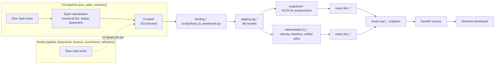

# CPG Pulse — Source-to-Target Mapping

Traces each of the 9 source datasets through every layer:
**raw → standardized → curated → landing → staging → marts**. This is the
explicit version of what the code already does implicitly across
`ingestion/*/ingest.py` → `spark/jobs/*.py` → `scripts/load_to_warehouse.py`
→ `dbt/models/staging/*.sql` → `dbt/models/marts/**/*.sql`.

Two genuinely different pipelines exist depending on the source, and this
document is explicit about which is which — see
`docs/remaining_work.md` §5 for why (PySpark could never be executed in this
project's development environment).

- **Full pipeline** (retail_pos_sales, retail_inventory): ingestion → real
  PySpark standardization (canonical ID resolution, dedup, quarantine) →
  curated parquet → `load_to_warehouse.py`'s "real pipeline path" → landing →
  staging → marts.
- **Partial pipeline** (everything else): ingestion → raw (byte-exact) →
  `load_to_warehouse.py`'s **local-dev fallback path** (a simpler,
  pandas-based stand-in — canonical ID resolution and dedup for
  transactional sources, direct passthrough for reference sources, since
  they need no transformation) → landing → staging → marts.

Both pipelines converge at **landing** — dbt's staging models don't know or
care which path a given row took to get there.

---

## Retail POS Sales — full pipeline

| Layer | Location | What happens |
|---|---|---|
| Raw | `data/lake/raw/retail_pos_sales/ingest_date=.../extract_date=.../` | `ingestion/retailer_sales/ingest.py` lands the file byte-exact |
| Standardized | `data/lake/standardized/retail_pos_sales/` | `spark/jobs/standardize_pos_sales.py`: explicit type casts, SCD2-aware `retailer_product_id → product_id` resolution (`spark/transformations/canonical_ids.py`), store validation, dedup on business key, invalid rows → quarantine with reason (`UNRESOLVED_RETAILER_PRODUCT_ID`, `INVALID_OR_CLOSED_STORE`, `NON_POSITIVE_UNITS_SOLD`, `NEGATIVE_OR_NULL_NET_SALES`, `SELLING_PRICE_EXCEEDS_THRESHOLD`, `INVALID_SALES_CHANNEL`) |
| Curated | `data/lake/curated/retail_pos_sales/` | `spark/jobs/run_quality_checks.py` runs the `pos_sales_suite` (`spark/quality/expectations/pos_sales_suite.yml`), logs `dq_results`, promotes the full standardized batch (DQ here is alerting, not an additional filter) |
| Landing | `landing.retail_pos_sales` (warehouse DB) | `scripts/load_to_warehouse.py` — real path if curated parquet exists, else fallback: resolves `product_id` via `retailer_product_mapping` (SCD2-aware merge), drops unresolved/duplicate rows |
| Staging | `staging.stg_retail_pos_sales` | Explicit casts, defense-in-depth `row_number()` dedup |
| Marts | `marts.fact_retail_sales` | Grain: retailer × store × retailer_product × transaction_date × sales_channel |

## Retail Inventory — full pipeline

Same shape as POS Sales, with one extra wrinkle:

| Layer | What happens |
|---|---|
| Raw | Byte-exact, including whichever column name (`reserved_qty` pre-2025-09-01, `reserved_units` after) the source file actually used |
| Standardized | `spark/jobs/standardize_inventory.py` **reconciles the rename** via `spark/transformations/common.py::rename_columns` (coalesces both names into canonical `reserved_units`, including the edge case where a single raw batch contains both — a late pre-change file and an on-time post-change file landing in the same `extract_date` partition), casts `on_order_units` null → 0, quarantines `AVAILABLE_EXCEEDS_ON_HAND_INCONSISTENCY` etc. |
| Landing (fallback path) | `scripts/load_to_warehouse.py::_fallback_standardize` mirrors the same rename-reconciliation logic in pandas |
| Marts | `marts.fact_inventory_snapshot` — grain: retailer × store × retailer_product × snapshot_date |

## Manufacturer Shipments — partial pipeline

| Layer | What happens |
|---|---|
| Raw | Byte-exact via `ingestion/shipments/ingest.py` |
| Standardized | **Not built** — no `spark/jobs/standardize_shipments.py` yet (see `docs/checklist.md` Phase 4) |
| Landing (fallback path) | Loaded directly — already keyed on the canonical `product_id` (an internal ERP feed, no retailer mapping needed), so the fallback loader applies no transformation beyond type coercion |
| Staging | `staging.stg_manufacturer_shipments` — computes `delivery_variance_days` |
| Marts | `marts.fact_shipments` |

## Promotions — partial pipeline, reference-style

| Layer | What happens |
|---|---|
| Raw | Byte-exact, idempotent content-hash-based landing (full-snapshot source, not date-partitioned — `ingestion/promotions/ingest.py`) |
| Standardized | Not built (not needed — no retailer-ID resolution required, `product_id` is already canonical) |
| Landing | Direct passthrough (reference source) |
| Staging | `staging.stg_promotions` |
| Marts | `marts.dim_promotion` (SCD1) + `marts.fact_promotions` (date-exploded) + `intermediate.int_promotion_baseline` + `marts.mart_promotion_effectiveness` |

## E-commerce Orders — partial pipeline

| Layer | What happens |
|---|---|
| Raw | Byte-exact via `ingestion/ecommerce/ingest.py` |
| Standardized | Not built |
| Landing (fallback path) | Direct load — like shipments, already keyed on canonical `product_id` |
| Staging | `staging.stg_ecommerce_orders` — defense-in-depth dedup |
| Marts | `marts.fact_ecommerce_orders`, feeds `intermediate.int_product_daily_sales` → `marts.mart_omnichannel_performance` |

## Product Master, Store Master, Retailer Product Mapping, Retailers, Distribution Centers, Calendar — reference sources

All six share one pattern: full-snapshot files, ingested idempotently via
content-hash comparison (`ingestion/product_master/ingest.py` handles all
six), loaded directly into `landing` with no transformation
(`scripts/load_to_warehouse.py::load_reference_tables`), staged with light
type casting, and built into dimensions:

| Source | Staging model | Marts model(s) |
|---|---|---|
| `product_master` | `stg_product_master` | `dbt/snapshots/dim_product_snapshot.sql` (SCD2) → `dim_product` |
| `store_master` | `stg_store_master` | `dbt/snapshots/dim_store_snapshot.sql` (SCD2) → `dim_store` |
| `retailer_product_mapping` | `stg_retailer_product_mapping` | `dim_retailer_product_mapping` (native SCD2, no snapshot — see `docs/remaining_work.md` #2) |
| `retailers` | `stg_retailers` | `dim_retailer` (SCD1) |
| `distribution_centers` | `stg_distribution_centers` | `dim_distribution_center` |
| `calendar` | `stg_calendar` | `dim_date` |

**Important**: `dim_product_snapshot`/`dim_store_snapshot` select from the
*staging* models (`ref('stg_product_master')`), not `source('landing', ...)`
directly — this is deliberate (fixed a real `upc` bigint/text bug — see
`docs/remaining_work.md` #2) and has a real ordering consequence: staging
must be built (`dbt run --select staging`) **before** `dbt snapshot` runs, or
the snapshot fails with "relation does not exist." See `Makefile`'s
`dbt-run` target and `.github/workflows/ci.yml` for the correct sequence
(also documented in `docs/remaining_work.md` §3, where this exact bug was
caught by dry-running the sequence against a from-scratch database).

## Pipeline Metadata — a ninth "source," of sorts

`pipeline_meta.dq_results` and `pipeline_meta.pipeline_runs` live in the
**metadata** database, a separate physical database from the warehouse
(`docs/architecture.md` section 4). `scripts/load_to_warehouse.py::load_pipeline_metadata`
copies them into `landing.dq_results`/`landing.pipeline_runs` in the
**warehouse** database, purely so dbt (which only targets one database) can
build `stg_dq_results` → `marts.fact_data_quality_results` →
`marts.mart_data_quality_summary` from them like any other source.

---

## Summary Diagram

